Algoritmo CMA-ES
================
Walter Mottinelli <wmotti@gmail.com>
v0.1, 20 Dicembre 2007
:author initials: WM

Papers di riferimento
---------------------
link:../papers/Hansen,Ostermeier_-_Completely_Derandomized_Self-Adaptation_in_Evolution_Strategies.pdf[Hansen, Ostermeier - Completely Derandomized Self-Adaptation in Evolution Strategies (2001)]

link:../papers/Hansen,Kern_-_Evaluating_the_CMA_evolution_strategy_on_multimodal_test_functions.pdf[Hansen, Kern - Evaluating the CMA evolution strategy on multimodal test functions (2004)]

Implementazione di riferimento
------------------------------
link:http://www.cmap.polytechnique.fr/~nikolaus.hansen/purecmaes.m[purecmaes.m by Nikolaus Hansen]

Implementazione in Scilab
-------------------------
link:../cmaes.sci[Scilab code]

link:../cmaes-highlighted.html[Scilab highlighted code for HTML viewing]

Esempi
------
A 10 dimensioni
~~~~~~~~~~~~~~~
Sphere function
^^^^^^^^^^^^^^^
Output finale dell'algoritmo (numero di valutazioni della fitness function, valore finale della fitness function, valori finali delle variabili):

------------------------
 2440: 7.051D-11

ans  =

  - 0.0000006
  - 0.0000040
  - 0.0000069
  - 0.0000018
  - 0.0000017
  - 0.0000015
  - 0.0000017
  - 0.0000012
    0.0000021
  - 0.0000010
------------------------

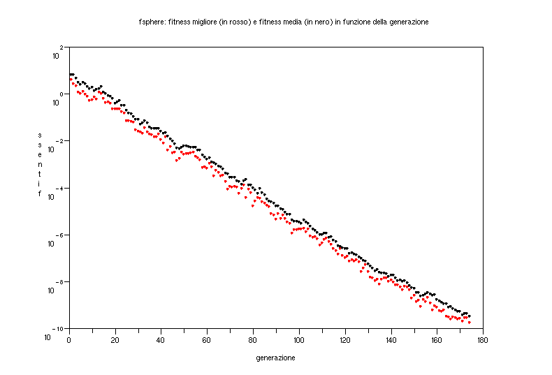

Schwefel function
^^^^^^^^^^^^^^^^^
Output finale dell'algoritmo:

------------------------
 2490: 9.202D-11

ans  =

  - 0.0000045
    0.0000014
    0.0000007
    0.0000043
  - 0.0000017
    0.0000047
  - 0.0000076
  - 0.0000015
    0.0000027
  - 0.0000001
------------------------

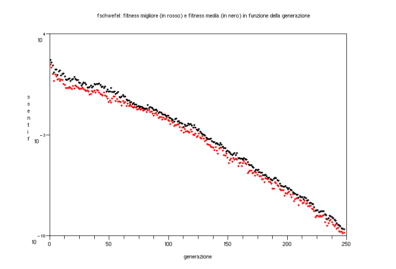

Cigar function
^^^^^^^^^^^^^^
Output finale dell'algoritmo:

------------------------
 5210: 4.928D-11

ans  =

    0.0000015
  - 1.468D-09
    1.648D-09
  - 2.287D-09
    3.982D-09
    1.626D-10
    1.649D-09
    1.233D-09
    3.723D-09
  - 1.741D-09
------------------------

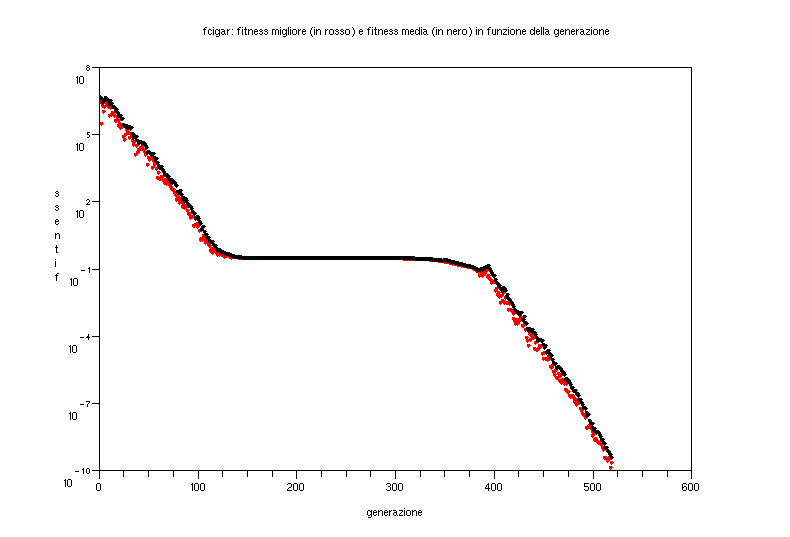

Cigtab function
^^^^^^^^^^^^^^^
Output finale dell'algoritmo:

------------------------
 6270: 8.300D-11

ans  =

  - 0.0000008
  - 4.073D-08
    8.682D-09
  - 1.666D-08
  - 6.243D-08
    3.986D-09
    2.741D-08
    2.067D-08
  - 1.400D-08
    3.052D-10
------------------------

image:../examples/10-dimensional/images/fcigtab_fitness.png[Fitness migliore (in rosso) e fitness media (in nero) in funzione della generazione]

Tablet function
^^^^^^^^^^^^^^^
Output finale dell'algoritmo:

------------------------
 5820: 9.375D-11

ans  =

  - 2.347D-09
    0.0000029
  - 0.0000034
    0.0000030
    0.0000013
  - 0.0000051
  - 0.0000012
    0.0000051
    0.0000013
    0.0000014
------------------------

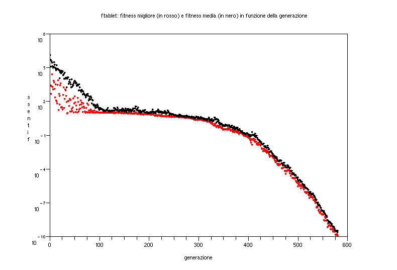

Elliptical function
^^^^^^^^^^^^^^^^^^^
Output finale dell'algoritmo:

------------------------
 6520: 8.446D-11

ans  =

  - 0.0000029
    0.0000003
  - 0.0000001
    0.0000004
  - 5.649D-08
  - 0.0000001
  - 1.065D-08
    5.602D-09
  - 5.951D-09
  - 2.300D-09
------------------------

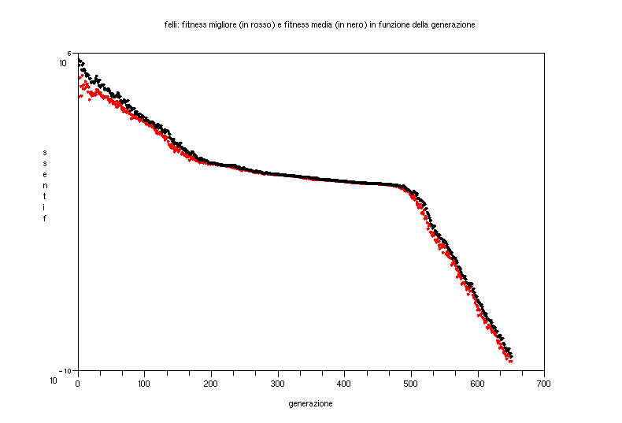

Elliptical-100 function
^^^^^^^^^^^^^^^^^^^^^^^
Output finale dell'algoritmo:

------------------------
 4040: 7.850D-11

ans  =

    0.0000021
  - 0.0000042
  - 0.0000006
    0.0000003
    0.0000002
    7.500D-08
  - 0.0000001
  - 7.367D-08
  - 2.231D-08
  - 4.303D-10
------------------------

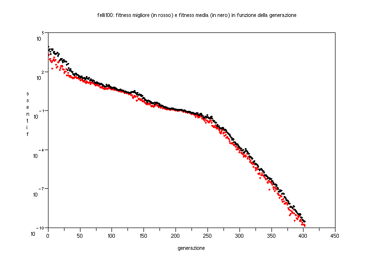

Diffpow function
^^^^^^^^^^^^^^^^
Output finale dell'algoritmo:

------------------------
 3690: 9.627D-11

ans  =

    0.0000016
  - 0.0000617
  - 0.0005887
    0.0050515
  - 0.0061822
    0.0050598
  - 0.0393191
    0.0797684
  - 0.0587155
  - 0.1431451
------------------------

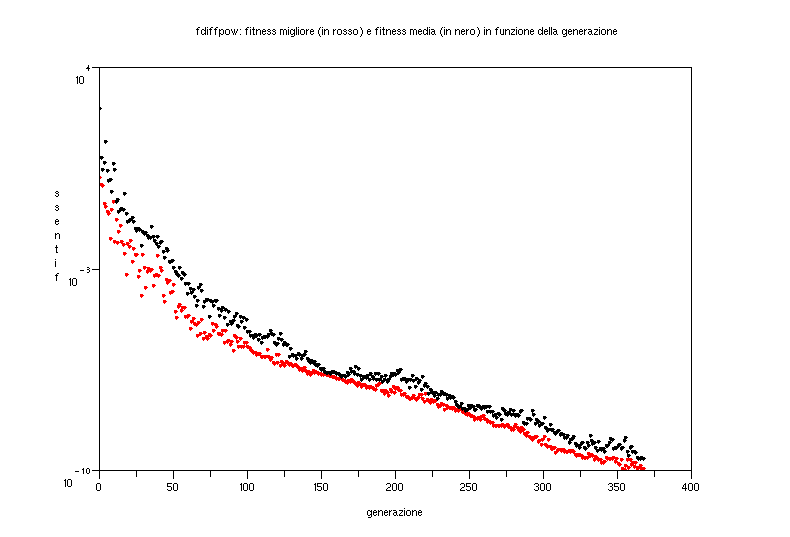

Rastrigin-10 function
^^^^^^^^^^^^^^^^^^^^^
Output finale dell'algoritmo:

------------------------
 68400: 6.960D-11

ans  =

  - 4.393D-08
  - 0.0000002
  - 0.0000002
    1.744D-08
  - 2.530D-08
    6.449D-08
    3.056D-08
  - 4.704D-08
    1.018D-08
    2.119D-08
------------------------

Convergenza della funzione multimodale rastrigin10 raggiunta con i parametri:

------------------------
lambda = 600;
xmean = rand(N,1)*10-5;
sigma = 5;
------------------------

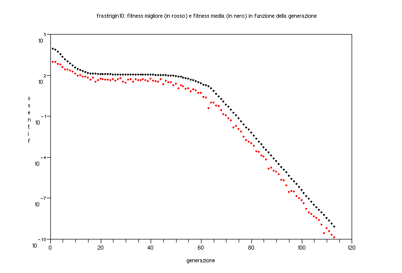

A 2 dimensioni
~~~~~~~~~~~~~~

Sphere function
^^^^^^^^^^^^^^^^
Grafico della funzione:

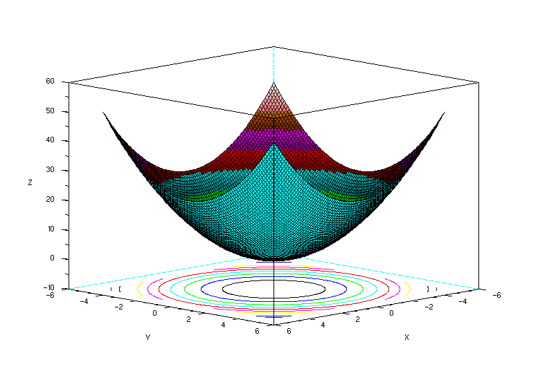

Output finale dell'algoritmo:

------------------------
 372: 5.739D-11

ans  =

  - 0.0000048
  - 0.0000059
------------------------

Fitness migliore (in rosso) e fitness media (in nero) in funzione della generazione:

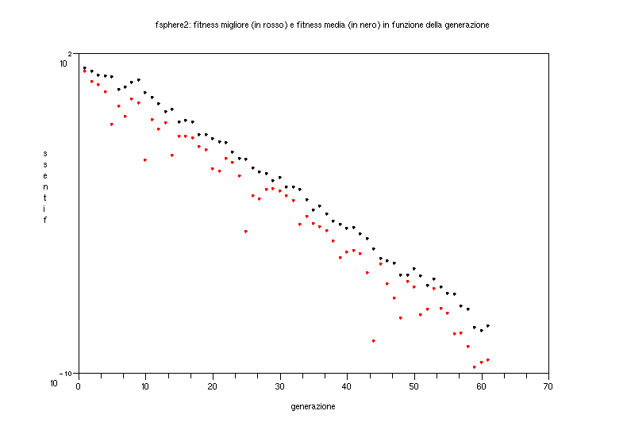

Fitness migliore (in rosso) e fitness media (in nero) in funzione della generazione (scala logaritmica su asse delle ordinate):

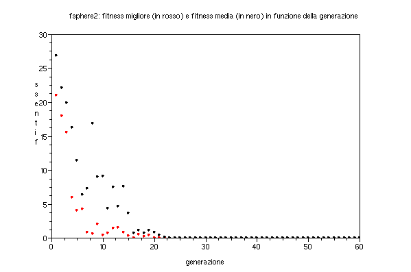

Path di ricerca della soluzione ottima:

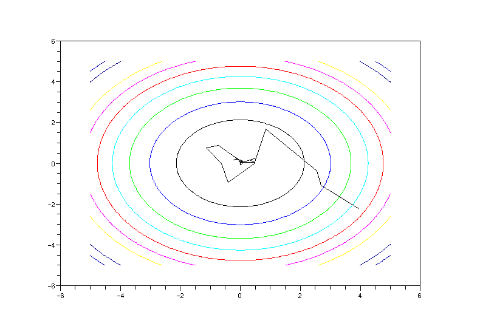

Schwefel function
^^^^^^^^^^^^^^^^^
Grafico della funzione:

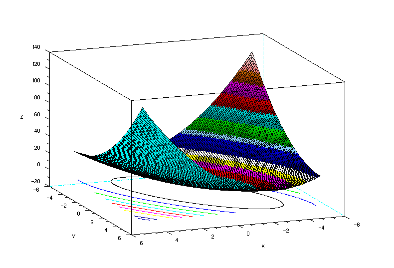

Output finale dell'algoritmo:

------------------------
 372: 2.262D-11

ans  =

  - 0.0000047
    0.000005
------------------------

Fitness migliore (in rosso) e fitness media (in nero) in funzione della generazione (scala logaritmica su asse delle ordinate):

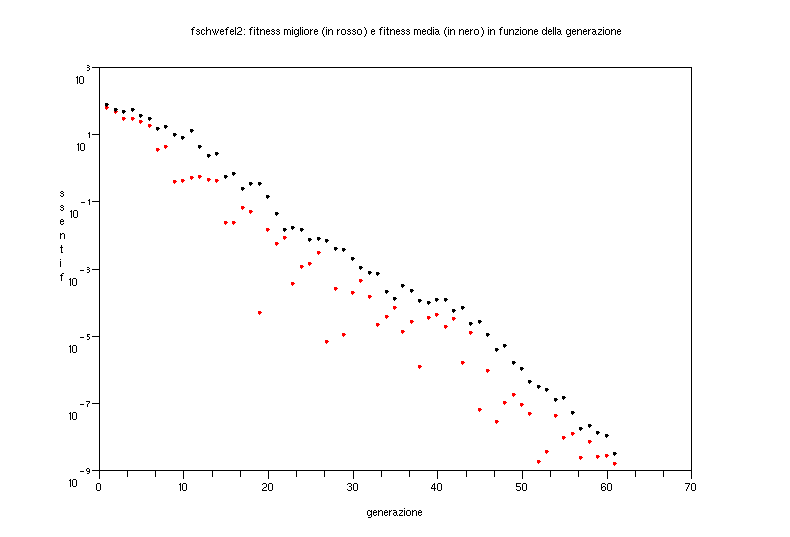

Path di ricerca della soluzione ottima:

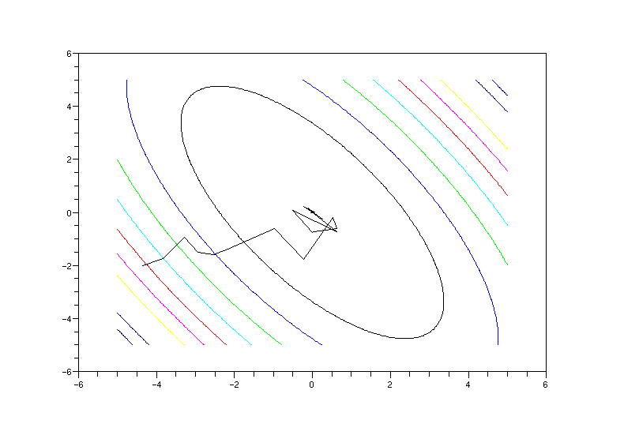

Cigar function
^^^^^^^^^^^^^^
Grafico della funzione:

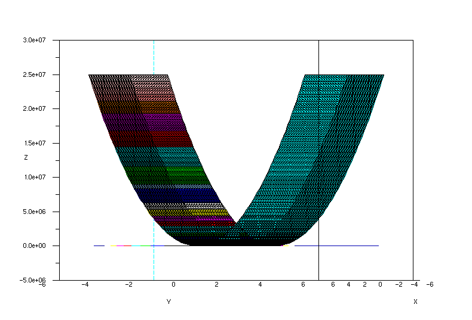

Output finale dell'algoritmo:

------------------------
 888: 3.374D-11

ans  =

  - 1.556D-08
    5.809D-09
------------------------

Fitness migliore (in rosso) e fitness media (in nero) in funzione della generazione (scala logaritmica su asse delle ordinate):

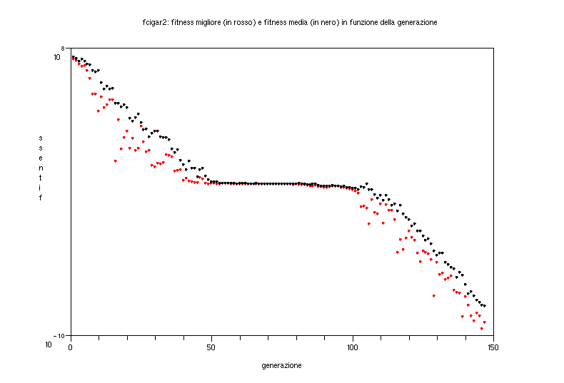

Path di ricerca della soluzione ottima:

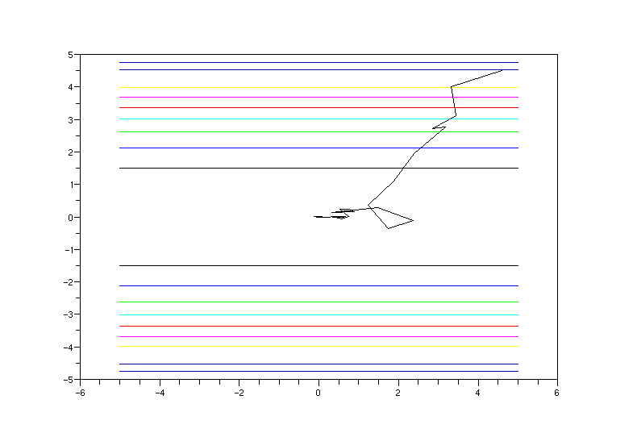

Rastrigin function
^^^^^^^^^^^^^^^^^^
Grafico della funzione:

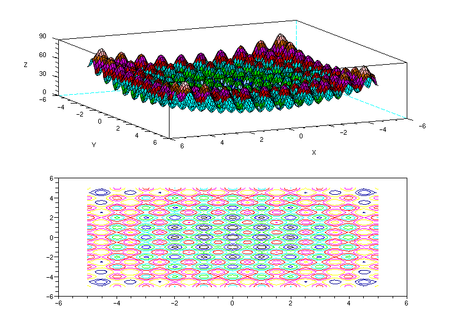

Output finale dell'algoritmo:

------------------------
 4050: 0.0000105

ans  =

  - 0.0002062
  - 0.0001033
------------------------

Fitness migliore (in rosso) e fitness media (in nero) in funzione della generazione (scala logaritmica su asse delle ordinate):

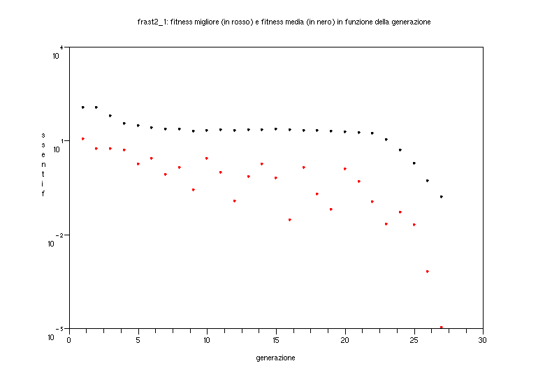

Path di ricerca della soluzione ottima:

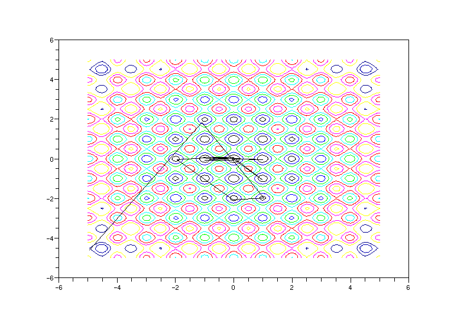

Rastrigin-10 function
^^^^^^^^^^^^^^^^^^^^^
Grafico della funzione:

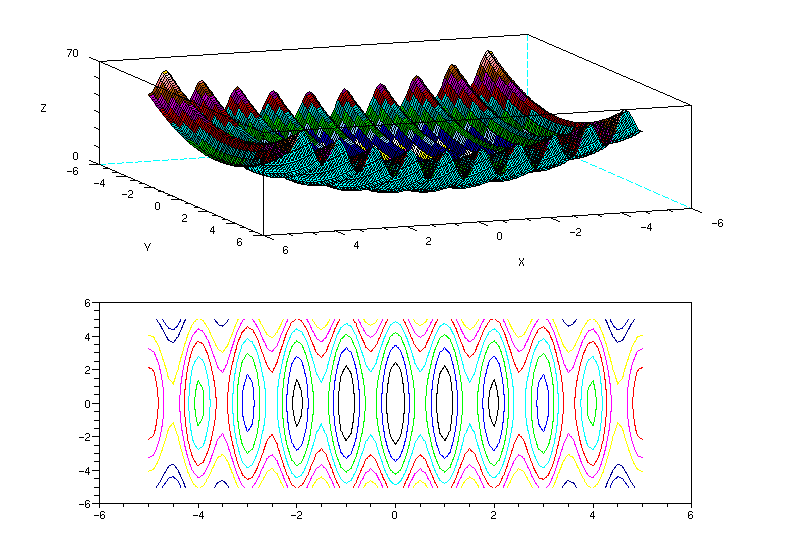

Output finale dell'algoritmo:

------------------------
 4050: 0.1179572

ans  =

    0.0189865
    0.0986343
------------------------

Fitness migliore (in rosso) e fitness media (in nero) in funzione della generazione (scala logaritmica su asse delle ordinate):

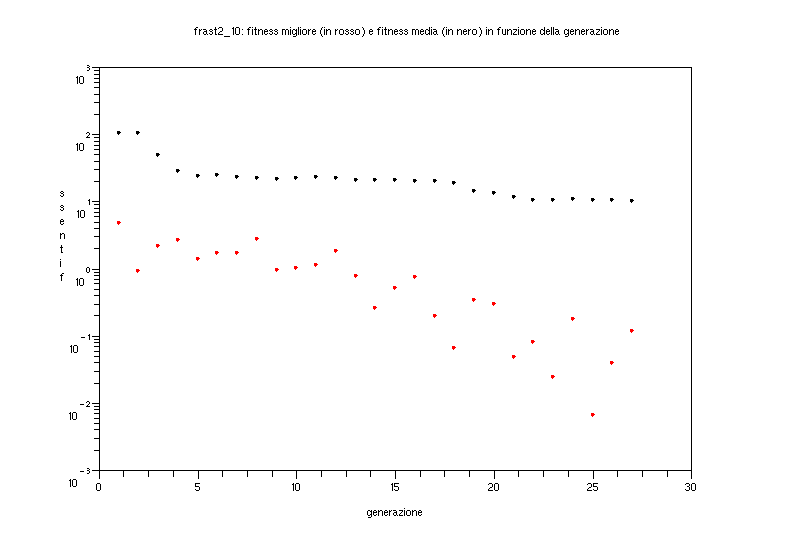

Path di ricerca della soluzione ottima:

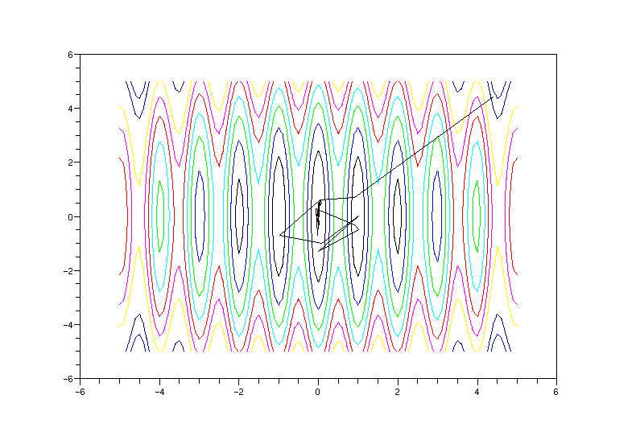

Rastrigin-1000 function
^^^^^^^^^^^^^^^^^^^^^
Grafico della funzione:

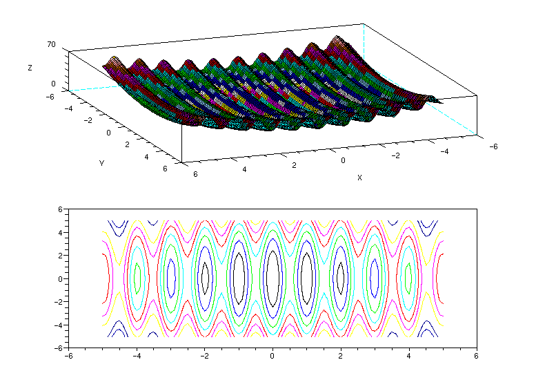

Output finale dell'algoritmo:

------------------------
 4050: 0.0073301

ans  =

    0.0000421
  - 0.0199942
------------------------

Fitness migliore (in rosso) e fitness media (in nero) in funzione della generazione (scala logaritmica su asse delle ordinate):

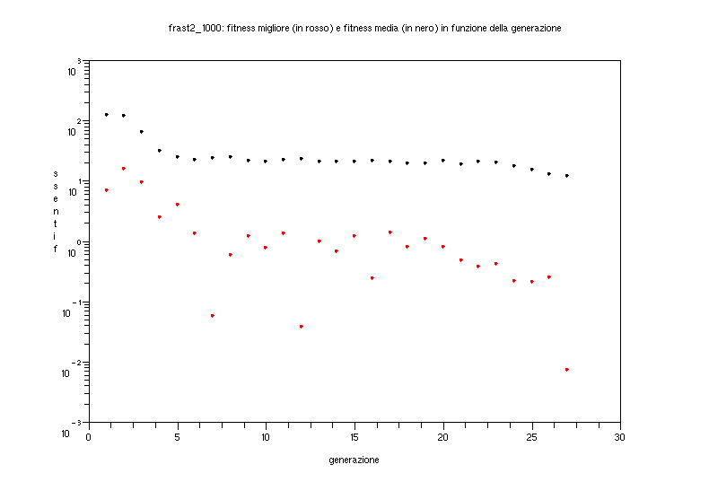

Path di ricerca della soluzione ottima:

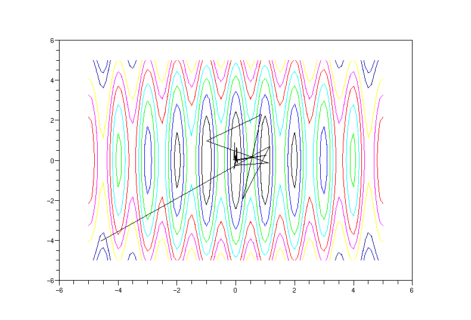
